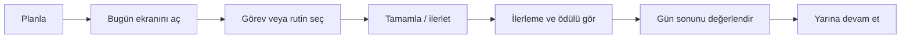
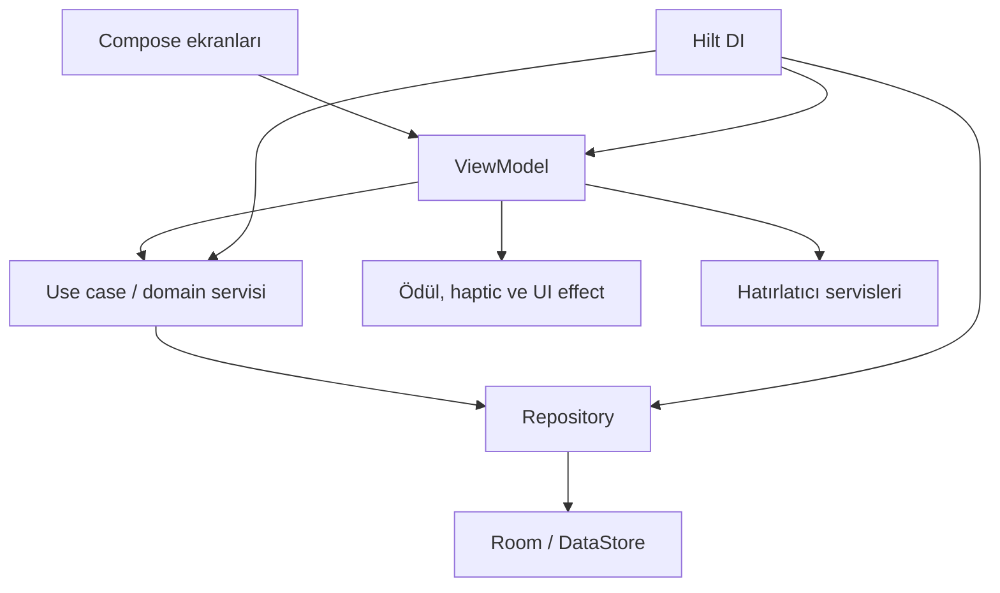

# BenimGünlerim — Tasarım ve Teknik Mimari Rehberi

> Son güncelleme: 2026-07-30  
> Durum: yaşayan tasarım belgesi  
> Güncel sprint ve teslim durumu için: [docs/PROJECT_STATUS.md](docs/PROJECT_STATUS.md)

## İçindekiler

1. [Ürün özeti](#1-ürün-özeti)
2. [Ürün felsefesi](#2-ürün-felsefesi)
3. [Deneyim ilkeleri](#3-deneyim-ilkeleri)
4. [Bilgi mimarisi ve ekranlar](#4-bilgi-mimarisi-ve-ekranlar)
5. [Temel kullanıcı akışları](#5-temel-kullanıcı-akışları)
6. [Görsel tasarım sistemi](#6-görsel-tasarım-sistemi)
7. [İçerik ve dil ilkeleri](#7-içerik-ve-dil-ilkeleri)
8. [Teknik mimari](#8-teknik-mimari)
9. [Veri modeli ve yerel saklama](#9-veri-modeli-ve-yerel-saklama)
10. [Oyunlaştırma ve geri bildirim](#10-oyunlaştırma-ve-geri-bildirim)
11. [Bildirimler, gizlilik ve hata yönetimi](#11-bildirimler-gizlilik-ve-hata-yönetimi)
12. [Erişilebilirlik, kalite ve test](#12-erişilebilirlik-kalite-ve-test)
13. [Geliştirme kararları](#13-geliştirme-kararları)

## 1. Ürün özeti

BenimGünlerim, kişinin gününü küçük ve yönetilebilir adımlarla planlamasına, görev ve rutinlerini takip etmesine, ilerlemesini fark etmesine yardımcı olan offline-first Android uygulamasıdır.

Ürün bir yapılacaklar listesi değildir; aşağıdaki üç ihtiyacı tek döngüde buluşturur:

- Günlük yapılacakları netleştirmek
- Tekrarlayan alışkanlıkları sürdürülebilir kılmak
- İlerlemenin görünür ve sakin biçimde hissedilmesini sağlamak

Ana ürün cümlesi:

> Gününü küçük adımlarla düzenle, ilerlemeni fark et ve yarına daha hafif başla.

## 2. Ürün felsefesi

### Küçük adımlar gerçek ilerlemedir

Bir görevin ya da rutinin tamamlanması, büyüklüğünden bağımsız olarak görünür bir ilerlemedir. Arayüz, küçük kazanımları abartmadan fark edilir hale getirmelidir.

### Kullanıcı suçlanmaz

Kaçırılan rutinler veya ertelenen görevler bir başarısızlık etiketi değildir. Uygulama yeniden başlama, taşıma, atlama ve günü kapatma yollarını açık tutar.

### Sadelik önceliklidir

Yeni bir özellik, kullanıcının “Bugün ne yapacağım?” sorusuna daha hızlı cevap vermiyorsa ana deneyimi karmaşıklaştırmamalıdır.

### Kontrol kullanıcıdadır

Kullanıcı bildirimlerini, verisini, rutinlerini, görevlerini ve oyunlaştırma tercihlerinin etkisini yönetir. Uygulama kullanıcının yerine karar vermez.

### İlerleme görünür, baskı görünmez olmalıdır

Skor, seri, XP, altın ve başarımlar; sürekli performans baskısı kurmak için değil, çabanın birikmesini görünür kılmak için vardır.

## 3. Deneyim ilkeleri

| İlke | Uygulamadaki karşılığı |
|---|---|
| İlk bakışta netlik | Bugün ekranı açık görevleri, rutinleri ve günlük ilerlemeyi öne çıkarır. |
| En kısa yol | Görev ekleme, tamamlama ve rutin işaretleme az adımla yapılır. |
| Sakin geri bildirim | Tamamlanma anında haptic, XP/ödül ve görünür state güncellemesi kullanılır. |
| Bağlamı koruma | Plan ekranı geleceği düzenler; Bugün ekranı o günün eylemini yönetir. |
| Hata toleransı | Geri alma, görevi taşıma, günü atlama ve yeniden deneme seçenekleri bulunur. |
| Offline güveni | Kritik kişisel veriler cihazda tutulur; temel deneyim ağ gerektirmez. |

## 4. Bilgi mimarisi ve ekranlar

Alt navigasyon uygulamanın günlük kullanım merkezidir:

```text
Bugün | Plan | Rutinler | İlerlemen | Ayarlar
```

### Onboarding

Kullanıcının ihtiyacını ve yoğunluk tercihini anlamaya çalışır; örnek rutinler ve ilk görev önerisi verir. Hedef, kullanıcıyı uzun bir kurulum sürecine sokmadan ilk anlamlı plana ulaştırmaktır.

### Bugün

Ürünün ana ekranıdır. Bugüne ait görevleri, rutinleri, geciken işleri, günlük ilerlemeyi ve gün sonu akışını bir araya getirir.

- Görev ekleme ve düzenleme
- Görev/alt görev tamamlama
- Rutin işaretleme veya hedef progress güncelleme
- Geciken görevi bugüne ya da yarına taşıma
- Gün sonu özeti
- Önceki günü değerlendirme veya atlama

### Plan

Belirli bir tarihi yönetmek için kullanılır. Tarih seçme, görevi ekleme/düzenleme, silme ve ileri tarihe taşıma işlevlerini sunar. Plan, günlük odağı dağıtmadan geleceği düzenleme alanıdır.

### Rutinler

Aktif rutinlerin listesi ve oluşturma alanıdır. Rutinler iki ana biçimde çalışır:

- **Check tipi:** Bir kez tamamlanan alışkanlık
- **Hedef tipi:** Süre, miktar veya limit gibi sayısal ilerleme gerektiren alışkanlık

### Rutin detayı

Bir rutinin hedefi, tekrar günleri, geçmiş performansı, seri bilgisi ve düzenleme seçeneklerini gösterir.

### İlerlemen

Günlük sonuçları, tutarlılığı, seviye/XP durumunu, başarımları ve geçmiş günlerin genel resmini sunar. Bu ekranın amacı hesap verebilirlik değil, kişinin ilerleme örüntüsünü fark etmesidir.

### Başarımlar

Kazanılan ve henüz açılmamış başarımları gösterir. Başarımlar; görev, rutin, seri ve gün kapatma davranışlarını görünür biçimde kutlar.

### Ayarlar

Bildirim modu, sessiz saatler, sabah planlayıcı, gün sonu saati, kutlama tercihleri, yerel veri dışa aktarma/içe aktarma ve yerel verileri temizleme seçeneklerini içerir.

## 5. Temel kullanıcı akışları

### 5.1 Günlük döngü



### 5.2 Görev akışı

1. Kullanıcı Bugün veya Plan ekranından görev ekler.
2. Başlık zorunludur; not, tarih, saat, kategori, öncelik ve hatırlatıcı isteğe bağlıdır.
3. Görev seçilen günün listesine yazılır.
4. Kullanıcı görevi veya alt görevlerini tamamlar.
5. Tamamlanma kaydı ilerlemeye yansır; gerekirse geri alma sunulur.
6. Bekleyen/geciken iş, kullanıcı seçimiyle başka bir güne taşınabilir.

### 5.3 Rutin akışı

1. Kullanıcı rutin adı, hedef türü, tekrar günleri ve isteğe bağlı hatırlatıcı tanımlar.
2. Rutin uygun günde Bugün ekranında görünür.
3. Check tipi rutin tek işaretlemeyle tamamlanır.
4. Hedef tipi rutin artır/azalt veya değer güncelleme ile ilerletilir.
5. Hedefe ilk kez ulaşıldığında completion log, ödül ve seri bilgisi güncellenir.

### 5.4 Gün sonu akışı

1. Gün sonu saatinden sonra kullanıcı Gününü değerlendir akışına girebilir.
2. Tamamlanan işler, geciken işler ve toplam ilerleme gösterilir.
3. Kullanıcı ruh hali, enerji, kısa not, iyi an, zorluk ve yarın niyeti ekleyebilir.
4. İsterse geciken görevleri yarına taşır.
5. Gün özeti yerel olarak kaydedilir; uygun durumlarda ödül verilir.

### 5.5 Missed day akışı

Önceki gün kapanmadıysa uygulama kullanıcıya iki düşük baskılı seçenek sunar:

- **Değerlendir:** Önceki gün için özet formunu açar.
- **Atla:** Geçmiş günü otomatik kapatır ve kullanıcıyı bugüne döndürür.

## 6. Görsel tasarım sistemi

### Tasarım karakteri

Arayüz sıcak, açık, hafif ve gündelik olmalıdır. Amacı yoğun bir üretkenlik paneli olmak değil; günlük hayatın akışını yormadan desteklemektir.

### Tasarım tokenları

Temel tokenlar `ui/theme/DesignTokens.kt`, genel tema `ui/theme/Theme.kt`, Today ekranına özel tokenlar `ui/today/theme/TodayColorTokens.kt` altında tutulur.

Tokenlar aşağıdaki ihtiyaçları kapsar:

- Boşluk ve köşe yarıçapı
- Yüzey, arka plan, metin ve outline renkleri
- Ana, ikincil ve durum renkleri
- Ekranlar arası ortak kart/buton davranışı

### Ortak bileşenler

`ui/components/Common.kt`, ekranların tekrar eden görsel davranışlarını merkezileştirir:

- `ScreenBackground`
- `ScreenHeroCard`
- `AlertCard`
- `SectionHeader`
- `AppButton`
- `AppCard`
- `EmptyStateView`
- `WarningCard`

Ortak bileşen değişikliği, Today, Plan, Routines, Progress ve Settings ekranlarını etkileyebileceğinden görsel regresyon kontrolü gerektirir.

### Hiyerarşi kuralları

1. Her ekranda bir ana eylem bulunur.
2. Hero alanı yalnızca o ekranın karar vermeyi kolaylaştıran özetini taşır.
3. Kartlar bilgi gruplamak için kullanılır; kart içine kart yığılması önlenir.
4. Renk, dekorasyon değil durum ve öncelik anlatmak için kullanılır.
5. Tamamlanan içerik açık içerikten daha geri planda görünür; ancak okunabilir kalır.

## 7. İçerik ve dil ilkeleri

Kullanıcı metinleri `res/values/strings.xml` üzerinden yönetilir. Yeni görünen metin doğrudan Composable içinde yazılmamalıdır.

### Ton

- Kısa ve somut
- Sıcak fakat abartısız
- Destekleyici
- Suçlamayan
- Türkçe karakterleri doğru kullanan

### Örnekler

| Durum | Tercih edilen ifade | Kaçınılacak ifade |
|---|---|---|
| Boş gün | “Bugün için küçük bir adım ekleyebilirsin.” | “Bugün hiçbir şey yapmadın.” |
| Tamamlama | “Bir adım daha tamamlandı.” | “Mükemmel! Harikasın!!!” |
| Erteleme | “Bunu daha uygun bir güne taşıyabilirsin.” | “Yine erteledin.” |
| Kaçırılan rutin | “Yarın yeniden devam edebilirsin.” | “Serin bozuldu.” |

## 8. Teknik mimari

Uygulama Kotlin, Jetpack Compose, Room, DataStore, Hilt ve Navigation Compose ile geliştirilir. Mimari, ekran davranışını iş kurallarından ve yerel saklamadan ayırır.



### UI katmanı

Compose ekranları kullanıcı girdisini alır, ViewModel state’ini gözlemler ve yalnızca sunum kararlarını verir.

Önemli UI alanları:

- `ui/today/`
- `ui/plan/`
- `ui/routines/`
- `ui/progress/`
- `ui/settings/`
- `ui/onboarding/`
- `ui/achievements/`

### ViewModel katmanı

ViewModel’ler `StateFlow` üzerinden ekran durumunu yayımlar. Tek seferlik kullanıcı mesajları, geri alma ve hata bilgileri `UiEffect`/event biçiminde iletilir.

Örnekler:

- `TodayViewModel`: bugün snapshot’ı, görev/rutin aksiyonları, gün kapatma
- `PlanViewModel`: seçilen tarih ve görev yönetimi
- `RoutinesViewModel`: aktif rutinler ve rutin oluşturma
- `ProgressViewModel`: ilerleme snapshot’ı
- `SettingsViewModel`: kullanıcı tercihleri, veri ve reminder ayarları

### Domain katmanı

Use case’ler iş kurallarını taşır. Örnekler:

- `AddTaskUseCase`, `UpdateTaskUseCase`, `ToggleTaskUseCase`
- `AddRoutineUseCase`, `ToggleRoutineUseCase`, `UpdateRoutineProgressUseCase`
- `CloseDayUseCase`, `SaveMissedDaySummaryUseCase`, `CarryPendingTasksUseCase`
- `ObserveTodaySnapshotUseCase`, `ObservePlanSnapshotUseCase`, `ObserveProgressSnapshotUseCase`

Domain servisleri oyunlaştırma, seviye, ödül ve başarımları destekler:

- `GameEngine`
- `RewardGrantService`
- `RewardDisplayService`
- `AchievementTracker`
- `AchievementEvaluationService`

### Data katmanı

Repository’ler Room DAO’larını ve DataStore tercihlerini uygulama kullanımına uygun bir arayüzle sunar.

- `TaskRepository`
- `RoutineRepository`
- `CompletionLogRepository`
- `DailyStateRepository`
- `UserPreferencesRepository`
- `DataExportService` / `DataImportService`

### Dependency injection

Hilt modülleri `di/AppModule.kt` ve ilgili dispatcher/scope tanımlarında tutulur. Zaman bağımlılığı `DateTimeProvider`, periyodik tetikleyici bağımlılığı `TickerProvider` üzerinden soyutlanır; bu sayede testler sistem saatine bağlı kalmaz.

## 9. Veri modeli ve yerel saklama

Ana kişisel veriler Room veritabanında saklanır. Kullanıcı tercihleri DataStore ile yönetilir.

| Model | Sorumluluk |
|---|---|
| `TaskEntity` | Tek seferlik görev, tarih, saat, öncelik ve tamamlanma durumu |
| `SubTaskEntity` | Bir görevin alt adımları |
| `RoutineEntity` | Tekrarlayan alışkanlık, hedef türü/değeri ve zaman bilgisi |
| `CompletionLogEntity` | Görev/rutin tamamlama, progress veya atlama kaydı |
| `DailyStateEntity` | Gün sonu özeti, ruh hali, enerji, not ve kapanış bilgisi |
| `AchievementEntity` | Açılan başarımlar |
| `UserPreferences` | Onboarding, bildirim, sessiz saat, oyunlaştırma ve kullanım tercihleri |

### Offline-first yaklaşımı

- Temel ürün kullanımı internet gerektirmez.
- Veri cihazda saklanır.
- Import/export kullanıcı kontrollü yürütülür.
- Veritabanı değişiklikleri migration ile korunur; destructive migration kullanılmaz.

### Veri güvenliği ilkeleri

- İçe aktarma doğrulanır ve mümkün olduğunda transaction içinde uygulanır.
- Dışa aktarılan JSON kişisel içerik taşıyabilir; kullanıcıya görünür uyarı verilir.
- Yerel veri silme geri döndürülemez olduğu için onay gerektirir.
- Migration testleri yeni schema değişikliklerinin zorunlu parçasıdır.

## 10. Oyunlaştırma ve geri bildirim

Oyunlaştırma, ürünün amacı değil destekleyici katmanıdır.

### Ödül mekanikleri

- Görev/rutin tamamlama XP ve altın getirebilir.
- Hedefi ilk kez tamamlama tekrar ödül vermez.
- Tüm rutinleri tamamlama ve mükemmel gün için ek ödül verilebilir.
- Gün kapatma, günlük döngünün kapanışına anlamlı bir geri bildirim ekler.

### Koruyucu kurallar

- Aynı olay için ödül birden fazla kez verilmez (`RewardGrantService`).
- Ödül, tamamlamanın önüne geçmez; ana UI eylemi her zaman görev/rutin durumudur.
- Kaçırılan davranış için cezalandırıcı HP veya kayıp mekanikleri ürünün merkezinde değildir.
- Kutlama efektleri kullanıcı tercihiyle kapatılabilir.

### Geri bildirim kanalları

- State değişikliği
- Haptic geri bildirim
- Snackbar / UI effect
- XP ve ödül görünümü
- Seviye atlama ya da başarı açılma ekranı

## 11. Bildirimler, gizlilik ve hata yönetimi

### Bildirimler

Bildirim altyapısı rutin, görev, sabah planlayıcı ve gün sonu özetini kapsar.

- `RoutineReminderScheduler`
- `TaskReminderScheduler`
- `MorningPlannerScheduler`
- `DailySummaryScheduler`
- `ReminderBootstrapper`
- `BootReceiver` ve `TimeChangeReceiver`

Bildirim ilkeleri:

- İzin durumu merkezi bir policy ile değerlendirilir.
- Sessiz saatler korunur.
- Cihaz yeniden başlatıldığında reminder’lar yeniden planlanır.
- Bildirimler kısa, yardımcı ve yargılamayan olmalıdır.

### Gizlilik

Uygulama offline-first olduğundan kişisel görev ve rutin içeriği temel deneyimde yerel kalır. Export/import ve olası analytics/error reporting kararları kullanıcıya şeffaf biçimde açıklanmalıdır.

İlgili dokümanlar:

- [Privacy ve backup](docs/production/privacy-and-backup.md)
- [Türkçe privacy policy](docs/production/privacy-policy-tr.md)

### Hata yönetimi ve gözlemlenebilirlik

- `ErrorReporter` soyutlaması hata kayıtları için kullanılır.
- `LocalErrorReporter` yerel hata bilgisi tutabilir.
- `AppCrashHandler` uncaught exception akışını yakalar.
- Production crash/ANR provider kararı ve Play Console vitals takibi release öncesi tamamlanmalıdır.

## 12. Erişilebilirlik, kalite ve test

### Erişilebilirlik hedefleri

- Anlamlı `contentDescription` değerleri
- Yeterli dokunma alanı
- Renkten bağımsız durum iletimi
- Yeterli kontrast
- Büyük font ölçeğinde taşmayan düzen
- TalkBack odak sırasının mantıklı olması
- Tablet ve yatay ekran smoke testleri

### Test katmanları

| Katman | Amaç |
|---|---|
| Unit test | Use case, ViewModel, hesaplama ve veri dönüşümü |
| Android/DAO test | Room DAO, migration ve cihaz bağımlı veri davranışı |
| Compose UI test | Kritik ekranların görünmesi ve kullanıcı aksiyonları |
| Manuel cihaz testi | Bildirim, OEM pil optimizasyonu, font ölçeği ve gerçek akış |
| Build/lint gate | Derleme, statik kalite, coverage ve release güveni |

### Kalite kapıları

Geliştirme ve release kontrolleri için [docs/production/quality-gates.md](docs/production/quality-gates.md) referanstır.

Özetle:

- Lokal: mojibake taraması, unit test, debug lint ve debug build
- CI: PR kalite kapısı, release build ve artifact kontrolleri
- Release: signing, AAB, dış release readiness ve cihaz doğrulaması

### Bilinen açıklar

Aktif açıklar ve öncelik sırası [docs/PROJECT_STATUS.md](docs/PROJECT_STATUS.md) içinde tutulur. Öne çıkanlar:

- Compose instrumentation test launch/senkronizasyon problemi
- Tüm yayınlanmış schema sürümleri için migration matrisi
- Timezone/OEM bildirim testleri
- Erişilebilirlik ve büyük ekran doğrulaması
- Crash/ANR izleme ve release operasyonları

## 13. Geliştirme kararları

Yeni iş eklenmeden önce aşağıdaki sorular sorulmalıdır:

1. Kullanıcı bugün ne yapacağını daha hızlı anlayacak mı?
2. Küçük adımı tamamlamayı kolaylaştırıyor mu?
3. İlerlemeyi baskı kurmadan görünür kılıyor mu?
4. Offline-first, gizlilik ve kullanıcı kontrolü ilkelerini koruyor mu?
5. Ekranlar arası ortak bileşenleri veya veri sözleşmelerini etkiliyor mu?
6. Test, migration, erişilebilirlik ve dokümantasyon ihtiyacını açıkça kapsıyor mu?

Çoğu soruya olumlu cevap verilmiyorsa iş ya ertelenmeli ya da daha dar bir probleme bölünmelidir.

### Uygulama sırası

1. Mevcut temel akışı koru ve test et.
2. Metin, localization ve erişilebilirlik kalitesini koru.
3. Ortak UI bileşen değişikliklerinde ekran regresyonlarını kontrol et.
4. Veri/migration ve bildirimi gerçek cihaz koşullarında doğrula.
5. Release öncesi privacy, performans, monitoring ve Play Console gereksinimlerini tamamla.

## İlgili belgeler

- [Güncel proje durumu](docs/PROJECT_STATUS.md)
- [Ürün felsefesi ve kullanıcı akışları](docs/product/benimgunlerim-urun-felsefesi-ve-akislari.md)
- [Production readiness checklist](docs/production/production-readiness.md)
- [Kalite kapıları](docs/production/quality-gates.md)
- [Test stratejisi](docs/testing/test-strategy.md)
- [Agent ve Graphify kuralları](AGENTS.md)
